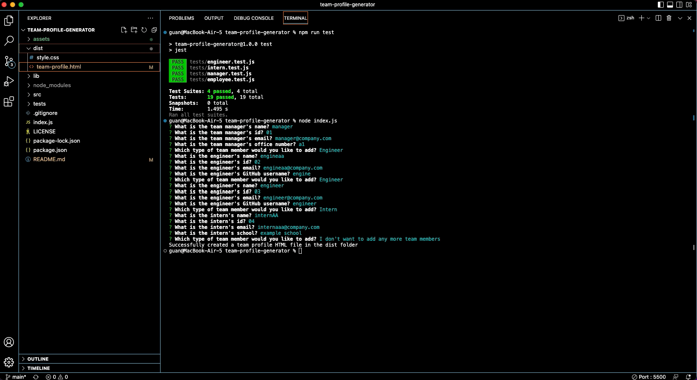

# Team Profile Generator

[](https://drive.google.com/file/d/1pbxo7HrgZ4yG87sgK_DiOmsUwtHSMqrW/view?usp=sharing)
## Description
This project was built to be able to generate a webpage for a team through the command-line so that emails and GitHub profiles can be quickly accessed through the webpage. Once the application has been initialized through the command-line, the user will be prompted for information about their team. Once the user has input their team information, a team-profile.html file will be generated in the dist folder with the name, role, id, and email of each of the team members. Manager's will have information on their office number, engineer's will have the link to thier GitHub profiles, and intern's will have their school listed.

## Technologies Used
- JavaScript
- Git
- GitHub
- Node.js

## Usage
In the command line run:
```console
node index.js
```
When prompted, answer the prompted questions about your team. After answering all the prompted questions, the message "Successfully created a team profile HTML file in the dist folder" will be displayed and a team-profile.html file will be created in the dist folder. The webpage can be accessed by opening the team-profile.html file in a default browser.

## License
Please refer to the LICENSE in the repo.

## Author Links
[GitHub](https://github.com/ncguan)